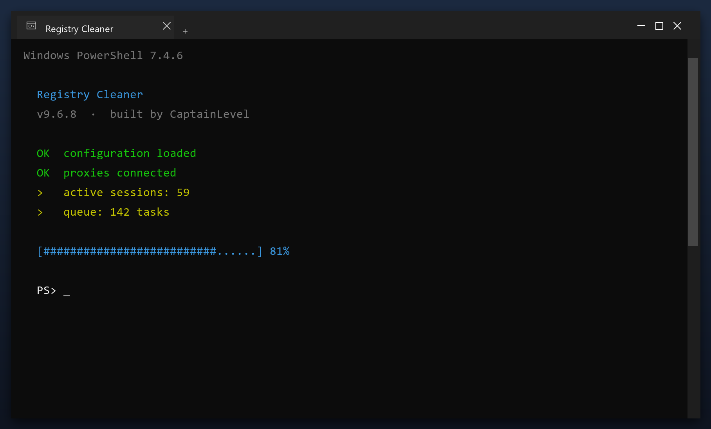

# Download Registry Cleaner for Free — Latest 2026 Version

  

  

Registry cleaner is a lightweight Windows program for maintaining your system. It runs offline, uses very little memory and does not slow your computer down. **Completely free.**

## Overview

Registry cleaner is what is often called a PC cleaner. It looks through the places Windows and your programs leave data behind - temp folders, logs, caches - and lets you remove it safely. A backup is made first, so nothing is lost by accident.

| **Term** | **Meaning** |
| --- | --- |
| **Temp folder** | Where programs dump scratch files |
| **Log** | A record file programs write |
| **Backup** | A copy you can restore |
| **Safe to delete** | Not needed by any program |

## The Problem

- **Disk almost full** - updates need space you do not have
- **Programs fight for RAM** - everything feels sluggish
- **Leftover drivers** - old devices still load software
- **Unchecked temp files** - they grow back every day
- **No clear report** - you cannot see what is using space

## How It Fixes It

| **Problem** | **Solution** |
| --- | --- |
| **Low disk space** | Free up space safely |
| **Freezes and errors** | Repair system entries |
| **Manual cleaning** | One-click maintenance |
| **Fake tools** | Tested build on this page |
| **Hard to use** | Simple, plain settings |

## Install

1. **Download** the tool with the button below
2. **Extract** the archive (WinRAR or 7-Zip)
3. **Run** the program as administrator
4. **Scan** - wait for the scan to finish
5. **Fix** - review the results and press the repair button

  

> **Note:** on first launch Windows may show a SmartScreen warning because the file is new. Click More info, then Run anyway.

## Features

| **Feature** | **Details** |
| --- | --- |
| **Windows** | 11, 10 (64-bit) |
| **Scan time** | 1-3 minutes |
| **Backup** | Automatic before changes |
| **Memory use** | Very low |
| **Price** | Free |
| **Internet** | Not required to run |

## Requirements

| **Component** | **Minimum** | **Recommended** |
| --- | --- | --- |
| **OS** | Windows 10 | Windows 11 (64-bit) |
| **RAM** | 2 GB | 4 GB |
| **Disk** | 100 MB free | 500 MB free |
| **Network** | For download | For updates |

## What's Included

| **Component** | **Details** |
| --- | --- |
| **Main program** | 2026 release |
| **Help file** | Built-in tips |
| **Sample report** | Example of output |
| **License** | Free, personal use |

## Compared With Alternatives

| **Feature** | **Big-name suites** | **registry cleaner** |
| --- | --- | --- |
| **Size** | Hundreds of MB | Small |
| **Ads in app** | Common | None |
| **Upsells** | Constant | None |
| **Background tasks** | Always on | Only when open |

## Tips

- Run the first scan with admin rights for full results
- Let it finish - do not close the window mid-scan
- Check the report before removing anything large
- Schedule a weekly scan if you use the PC daily
- Exclude the tool's own folder from antivirus

## Troubleshooting

| **Issue** | **Fix** |
| --- | --- |
| **High CPU during scan** | Expected - it throttles when you use the PC |
| **Antivirus blocks cleanup** | Add an exclusion for the tool |
| **Cleanup leaves temp files** | Some are locked - reboot and rescan |
| **Tool asks for admin** | Approve it so it can clean system areas |

## FAQ

**Is admin access required?**

For a full cleanup, yes. Without it the tool only cleans your user folders.

**Will it fix my registry?**

It can scan and repair broken entries, and it backs up before changing anything.

**Does it work offline?**

Yes - once downloaded it needs no internet connection.

**How much space will I save?**

It varies, but most PCs recover several gigabytes on the first run.

## Summary

**Registry cleaner** is a simple, reliable maintenance tool for Windows. It does one job well, without adware or confusing options.

**What you get:**

- The latest 2026 build
- Full Windows 10 and 11 support
- Quick setup, clear results
- No payments, no registration

**Get it now - completely free.**

---

*rebel-mint-485 · Updated 2026-10-09 · Shared under the MIT License*
